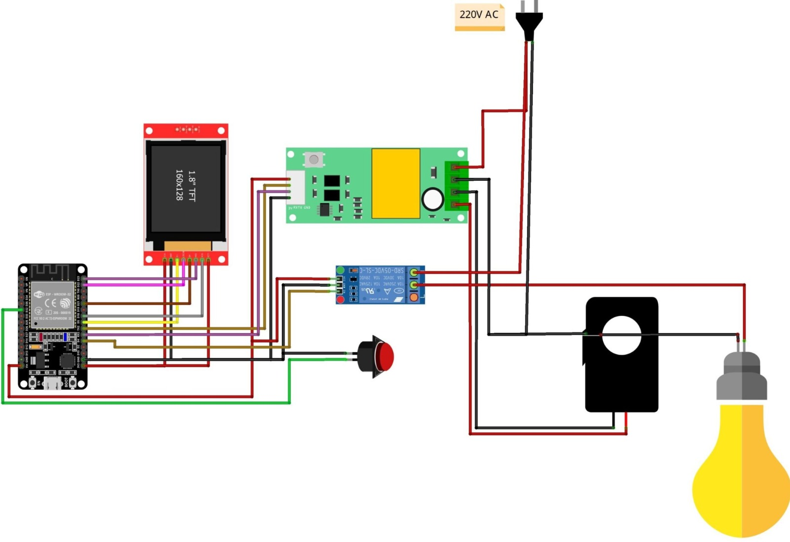
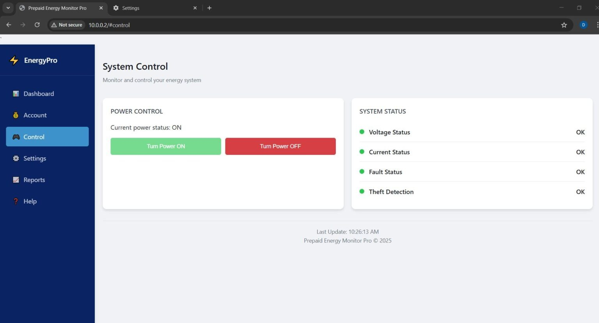

# ⚡ IoT-Based Prepaid Energy Meter for Apartments & Annexes in Sri Lanka

<p align="center">
  
</p>

<p align="center">
  
  
  
  
  
</p>

> A B.Sc. Engineering Group Project — Department of Electrical and Computer Engineering, Faculty of Engineering Technology, The Open University of Sri Lanka.

---

## 📌 Table of Contents

- [Overview](#overview)
- [Problem Statement](#problem-statement)
- [Features](#features)
- [System Architecture](#system-architecture)
- [Hardware Components](#hardware-components)
- [Circuit Diagram](#circuit-diagram)
- [How It Works](#how-it-works)
- [Web Dashboard](#web-dashboard)
- [Pin Configuration](#pin-configuration)
- [Software & Libraries](#software--libraries)
- [Getting Started](#getting-started)
- [Project Team](#project-team)
- [References](#references)
- [License](#license)

---

## 🔍 Overview

In Sri Lanka's rapidly urbanizing cities like Colombo, Gampaha, Kandy, and Galle, thousands of tenants in apartments and annexes share a single electricity meter. This leads to billing disputes, unfair cost distribution, and unpaid bills.

This project develops an **IoT-based Prepaid Energy Meter** using the **ESP32 microcontroller** and the **PZEM-004T energy monitoring module**. Each tenant receives a fixed monthly electricity allowance. The system monitors usage in real time, deducts from the prepaid balance, and automatically cuts off power when the balance reaches zero — restoring supply only after a top-up.

---

## ⚠️ Problem Statement

- **Billing disputes** — Tenants feel overcharged; landlords struggle to justify costs.
- **Unpaid bills** — When tenants default, landlords cover the total utility bill.
- **Overconsumption** — Without individual accountability, electricity is wasted.
- **Lack of transparency** — Tenants cannot track their own usage.

---

## ✅ Features

- 🔌 **Real-time energy monitoring** — Voltage, current, power, and energy via PZEM-004T
- 💰 **Prepaid balance management** — Landlord sets monthly allowance in kWh or LKR
- ⚡ **Automatic power cut-off** — Relay disconnects when balance reaches zero
- 🔔 **Low-balance alerts** — Displayed on TFT screen and web dashboard
- 🌐 **Wi-Fi web dashboard** — Accessible by both landlord and tenant
- 🔄 **Recharge functionality** — Top-up via web interface or recharge codes
- 🛡️ **Theft detection** — Detects current flow when relay is off
- ⚙️ **Configurable thresholds** — Over-voltage, over-current, and minimum balance limits
- 💾 **EEPROM persistence** — Balance and settings survive power cycles
- 📱 **Responsive dashboard** — Works on mobile and desktop browsers

---

## 🏗️ System Architecture

```
CEB/LECO Grid (220V AC)
        │
        ▼
  PZEM-004T Sensor  ──(Modbus TX/RX)──▶  ESP32 Controller
        │                                       │
        ▼                                 ┌─────┼──────────────┐
   Current Sensor                       Relay  TFT Display   Wi-Fi
        │                                  │                    │
        ▼                               Load              Cloud / Router
   Tenant Load                     (Apartment)                  │
  (Bulb / Appliances)                                    ┌──────┴──────┐
                                                    Admin Panel   Tenant App
                                                     (HTTPS)       (HTTPS)
```

---

## 🔧 Hardware Components

| Component | Description |
|---|---|
| **ESP32 Development Board** | Main microcontroller with built-in Wi-Fi |
| **PZEM-004T v3.0** | AC energy monitoring module (Voltage, Current, Power, Energy) |
| **1.8" TFT Display (ST7735)** | 160×128 colour display for local readout |
| **5V Relay Module** | Electrically isolates tenant load on zero balance |
| **Current Transformer (CT)** | External clamp for measuring AC current |
| **Push Button** | Page switching and manual relay override |
| **Jumper Wires & PCB/Breadboard** | Interconnections |
| **220V AC Supply** | Mains power input |

---

## 🔌 Circuit Diagram

<p align="center">
  
</p>
<p align="center">
  
</p>
*Components: ESP32 · 1.8" TFT Display · PZEM-004T · Relay Module · CT Sensor · Load Bulb · Push Button*

---

## ⚙️ How It Works

### Prepaid Logic Flow

```
Start / New Month
       │
       ▼
Landlord sets allowance (kWh or LKR)
       │
       ▼
ESP32 stores balance in EEPROM
       │
       ▼
Measure V / I / P / E  ◀──────────────────────┐
via PZEM-004T                                  │
       │                                       │
       ▼                                       │
Deduct energy cost from balance in real time   │
       │                                       │
       ▼                                       │
  Low balance? ──── No ─────────────────────────
       │
      Yes
       │
       ▼
Trigger low-balance alert (Display / SMS / App)
       │
       ▼
  Balance ≤ 0? ──── No ──▶ Continue monitoring
       │
      Yes
       │
       ▼
  Open relay (cut power)
       │
       ▼
   Wait for recharge
       │
       ▼
Landlord / Tenant adds credit
       │
       ▼
Update balance on cloud & ESP32
       │
       ▼
  Close relay (restore power)
```

---

## 🌐 Web Dashboard

The ESP32 hosts a responsive web interface accessible from any device on the local network.

<p align="center">
  
</p>
<p align="center">
  
</p>

**Dashboard sections:**
- **Dashboard** — Live voltage, current, power, energy, and balance cards
- **Account** — Recharge balance, view consumption rate
- **Control** — Manual relay on/off, system status indicators
- **Settings** — Configure over-voltage, over-current, theft threshold, cost per kWh
- **Reports** — Energy consumption analytics *(planned)*

**Default credentials:**
```
Username: admin
Password: admin123
```
> ⚠️ Change these before deployment!

---

## 📐 Pin Configuration

### TFT Display (ST7735) → ESP32

| TFT Pin | ESP32 Pin |
|---|---|
| VCC | 3.3V |
| GND | GND |
| CS | GPIO 5 |
| RST | GPIO 22 |
| DC (RS) | GPIO 21 |
| SDA (MOSI) | GPIO 23 |
| SCK | GPIO 18 |
| LED (BL) | 3.3V |

### PZEM-004T → ESP32

| PZEM Pin | ESP32 Pin |
|---|---|
| TX | GPIO 16 (RX2) |
| RX | GPIO 17 (TX2) |
| 5V | 5V |
| GND | GND |

### Other Connections

| Component | ESP32 Pin |
|---|---|
| Relay IN | GPIO 4 |
| Push Button | GPIO 32 |

---

## 🛠️ Software & Libraries

**IDE:** Arduino IDE (with ESP32 board support)

**Required Libraries:**

| Library | Purpose |
|---|---|
| [PZEM004Tv30](https://github.com/mandulaj/PZEM-004T-v30) | Energy sensor communication |
| [Adafruit GFX Library](https://github.com/adafruit/Adafruit-GFX-Library) | TFT graphics |
| [Adafruit ST7735 Library](https://github.com/adafruit/Adafruit-ST7735-Library) | TFT display driver |
| ArduinoJson | JSON data handling for web API |
| WebServer (built-in) | HTTP server on ESP32 |
| EEPROM (built-in) | Persistent storage of balance & settings |
| WiFi (built-in) | Wi-Fi connectivity |

---

## 🚀 Getting Started

### 1. Clone this repository
```bash
git clone https://github.com/YOUR_USERNAME/iot-prepaid-energy-meter.git
cd iot-prepaid-energy-meter
```

### 2. Install libraries
In Arduino IDE, go to **Sketch → Include Library → Manage Libraries** and install:
- `PZEM004Tv30` by mandulaj
- `Adafruit GFX Library`
- `Adafruit ST7735 and ST7789 Library`
- `ArduinoJson`

### 3. Configure Wi-Fi credentials
Open `main.ino` and update:
```cpp
const char* ssid     = "YourWiFiName";
const char* password = "YourWiFiPassword";
```

### 4. Upload the code
- Select board: **ESP32 Dev Module**
- Select the correct COM port
- Click **Upload**

### 5. Access the dashboard
- Open Serial Monitor at 115200 baud to get the assigned IP address
- Navigate to `http://<ESP32_IP_ADDRESS>` in your browser
- Log in with `admin` / `admin123`

### 6. Set prepaid balance
On the **Account** page, enter the monthly allowance and click **Recharge**.

---

## 👥 Project Team

| Name | Student ID |
|---|---|
| K.A.S. Kekulawala | 222519008 |
| H.S.R. Sarathchandra | 123644176 |
| N.G. Kaween Newmal | 123643509 |

**Supervisor:** Mr. Neil Herth — Lecturer, Department of Electrical and Computer Engineering  
**Institution:** The Open University of Sri Lanka  
**Presented:** 30 March 2026

---

## 📚 References

1. Noor Ziad Taha, Amera Istiqlal Badran, *"IoT Based Energy Monitoring and Control System,"* International Research Journal of Innovations in Engineering and Technology (IRJIET), Volume 7, Issue 3, pp 72–77, March 2023. DOI: [10.47001/IRJIET/2023.703009](https://doi.org/10.47001/IRJIET/2023.703009)

2. DIY Projects Labs — [IoT ESP32 Prepaid Energy Meter with PZEM-004T](https://diyprojectslabs.com/esp32-prepaid-energy-meter-pzem004t/)

---

## 📄 License

This project is licensed under the [MIT License](LICENSE).

---

<p align="center">Made with ❤️ at The Open University of Sri Lanka</p>
